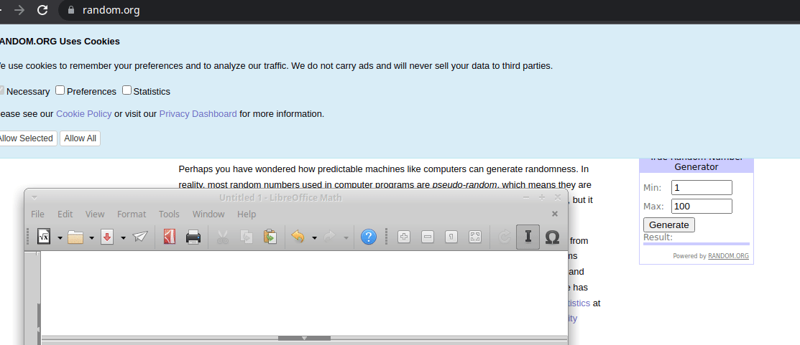

# Random.org Cheater

### Stop trusting randomizing sites!

The Random.org website has an [excellent article](https://giveaways.random.org/warning) about scammers who use a fake randomizer for their own purposes. The article mentions that the attacker is using a web page similar to Random.org, but with pre-installed draw results.

I will demonstrate to you that you can manipulate the drawing results by using the official Random.org website. To get started, watch the following video:

**So, BINGO!!! I won 1B dollars!!!**

But how? The certificates are signed, the site is real. Am I lucky?

Everything is very simple. Almost any programmer can write a program that change a click of a button event and change the behavior of the main workflow. It took me a few minutes to get the source code of the function that is executed when a random number is selected. And another 15 minutes I spent to write your own handler that can output random numbers.

But at a certain time, my function starts to return preset numbers instead of random numbers. I chose the option - show random numbers after the first 7 clicks, and then those that I need. But you can use a current time or send a request to a monitored server that would control the behavior of the "random number" fetch function

What I mean is that, in any case, you cannot trust randomizing sites, especially those that do not provide something similar to the Multi-Round Giveaway Service (Random.org does).

A few tips:
- don't trust any video. Anybody can fake any video without any problems ([deepfake examples](https://www.youtube.com/results?search_query=deepfake))
- you or your representative should be near the computer where the draw is taking place.
- it is advisable to enter the name of the site by yourself ( to avoid such thing as described in [that article](https://www.usatoday.com/story/news/factcheck/2021/04/30/fact-check-hackers-use-similar-looking-characters-phishing-schemes/4891437001/)
- ask to refresh the page - this will reset the actions of all pre-installed scripts
- check the site certificates
- ask to press several times the button which is responsible for issuing the result (4-10 times, at your discretion). If there is a preset initial sequence, it will be knocked down.
- use the [Multi-Round Giveaway Service checking](https://giveaways.random.org/) ;)
- You should know [where, who and how](https://en.wikipedia.org/wiki/Social_engineering_(security)) you can be deceived.

